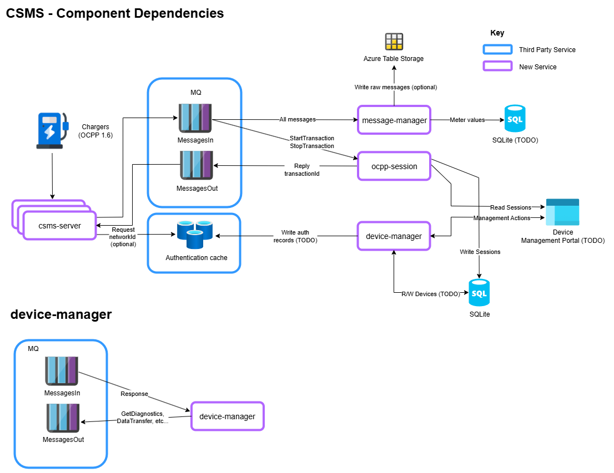

- [OCPP Charge Station Management System (CSMS)](#ocpp-charge-station-management-system-csms)
- [Architecture](#architecture)
  - [csms-server](#csms-server)
  - [message-manager](#message-manager)
  - [session](#session)
  - [device-manager](#device-manager)
- [Configuration](#configuration)
- [Building](#building)
  - [Local Development](#local-development)
    - [Configuration](#configuration-1)
    - [Running](#running)
    - [Logging](#logging)
    - [Packaging](#packaging)
  - [Containerisation](#containerisation)
    - [Building - Locally](#building---locally)
    - [Deploying (GCP)](#deploying-gcp)

# OCPP Charge Station Management System (CSMS)

OCPP Chargers typically need a backend CSMS so they can be managed or debugged. This provides such an interface.

This CSMS system comprises of the following components:

- ocpp-csms - websocket server for OCPP 1.6 ChargePoints
- message-manager - reads/writes events and messages from/to an MQ to a repository
- device-manager - manages device information & send arbitary commands to chargers (e.g `DataTransfer`, `SetChargingProfile`)
- session - handle Start/StopTransaction OCPP events

Note: This is a proof of concept only. It only handles a single tenant, there aren't any tests and there are TODOs everywhere in the code. 
However, it has been architected with the mindset of building out the services properly with a full feature set at a later date.

# Architecture

Proposed architecture:



## csms-server

This application server creates a multi websocket server for OCPP 1.6 ChargePoints to connect to.
It handles a subset of OCPP 1.6 messages to provide basic OCPP functionality to the ChargePoints.

Features:
  - OCPP Websocket server
  - Authenticates NetworkId against Redis
  - Responds to ClientToServer messages: `BootNotification, SecurityEventNotification, StatusNotification, Heartbeat, MeterValues`
  - Forwards messages to an MQ for consuming services (e.g message-writer), to a topic named `MessagesIn`, e.g:  
  - Receives messages from a `MessagesOut` topic and forwards to the relevant client.
 
```
{
	"serverNode": "dell0258",
	"client": "ocpp-charger1",
	"messageTime": "2023-09-29T11:57:11.489Z",
	"body": {
		"direction": 2,
		"msgId": "3c8a67617f404575b68e4ed8ef7bf212",
		"messageType": "Heartbeat",
		"messageBody": {}
	}
}
``` 
  - Receives messages from an MQ topic named `MessagesOut`, for messages sent to the client by other services, e.g:
```
TBC
```

MQ brokers supported:
- MangosMQ (brokerless, point to point) 

Consider these partially broken for now:
- RabbitMQ
- Redis pub/sub

Futures:
 - Support GCP Pub/Sub
 - Support a fuller set of OCPP messages

## message-manager

This application reads messages from a `MessagesIn` topic, containing OCCP messages from ChargePoints. 
It can write message to:
- Azure table storage in a table named `MessagesIn`.
- Postgresql TODO

Example table storage message:
```
{
    "PartitionKey": "ocpp-charger1",
    "RowKey": "1695983591193",
    "Timestamp": "2023-09-29T11:33:11.1938899Z",
    "serverNode": "dell1234",
    "direction": "2",
    "messageTime": "2023-09-29T11:33:11.190Z",
    "body": "{\"direction\":2,\"messageBody\":{},\"messageType\":\"Heartbeat\",\"msgId\":\"900229827f36444f81097b4298e7b112\"}"
}
```

## session

This binary reads from the `MessagesIn` message topic and handles `StartTransaction` and `StopTransaction` events. 
For StartTransaction, it:
- Creates a transaction in a backend sqlite DB in a `transactions` table
- Returns a transactionId to the client via the MessagesOut topic
- csms-server listens to and forwards to the relevant client.

## device-manager

This application manages OCPP devices, which can be manipulated by a REST API (TODO).

Changes to device configuration is updated in Redis, which can then be read by other services, such as WebSocketServer .

Responsibilities:
- Provides an API to mutate devices in the CSMS system
- Maintains authentication records (by networkId) in redis cache from data stored in SQL DB.

- REST API provides the ability to: 
  - Send `DataTransfer` & `SetChargingProfile` messages to connected networkIds.
  - TODO: Create ChargePoint (Redis): `Name, NetworkId, SerialNumber, TemplateId, PlugAndCharge`, which returns `ChargePointId` (aka extId)
  - TODO:  List all ChargePoints
  -  TODO: Get ChargePoint cached configuration by `ChargePointId`

Please see [./src/device-manager/deviceManager.http](./src/device-manager/deviceManager.http) file for example API requests and payloads.

# Configuration

All daemons read configuration from `../conf.yaml`, from their respective sections within the configuration. See [./src/cfg/conf.example.yaml](./src/cfg/conf.example.yaml) for an example.

# Building

## Local Development

- **Windows**: install Gitbash: https://git-scm.com/download/win
- **Ubuntu**: Install: `apt install build-essential dos2unix zip unzip git`
- Install Golang >=1.19 and ensure it's in the current PATH
- To build all binaries `cd ./src; ./build_local.sh`
  - Or from the `./src/NAME` where name is the daemon name, run: `go build  .` ensuring CGO is enabled.

### Configuration

Configuration for all daemons is stored in: `./cfg/conf.yaml` 
See `conf.example.yaml` for example configuration.

### Running

To run all binaries as daemons cd `./run_all.sh`

To omit a daemon from being started, e.g `device-manager`, run: `ans=device-manager ./run_all.sh`
This would typically be done if a daemon e.g `device-manager`, is being debugged from VSCode.

### Logging

All daemons log to: `./logs/*.log`
Logs are rotated when they reach 10MB, up to a maximum of 10 files.

### Packaging

To generate a tarball package for dev/QA use, run the following, explicitly setting the version number: 
```
version=1.1.0 ./package.sh
```

This will generate `./ocpp_csms-1.2.0.tgz`

## Containerisation

For containerisation, for the ease of deployment, currently all daemons run under the same container under `supervisord`.
The two entry points, i.e the OCPP websocket and device-manager HTTP API are fronted by an nginx instance.

This provides the following endpoints:

- OCPP v1.6 web-socket - `ws://localhost:8080/ocpp`- 
- device-manager API - `http://localhost:8080/device-manager`

### Building - Locally

Builds will work on Linux or Windows (via cross-compilation) and will generate a single container artifact which is self-contained, and can be deployed anywhere.

- Install Docker Desktop or Rancher Desktop (preferred)
- From the repo root:

```
docker build --no-cache -t ocpp-csms:latest .
docker run -d -p 8080:8080 --name ocpp-csms-container ocpp-csms:latest
```

### Deploying (GCP)

```
gcloud auth login
gcloud config set project YOUR_PROJECT
gcloud services enable run.googleapis.com artifactregistry.googleapis.com

# create a repo (once)
gcloud artifacts repositories create sw-ocpp-csms --repository-format=docker --location=uk

# tag your local image to the registry path
docker tag ocpp-csms:latest uk-docker.pkg.dev/YOUR_PROJECT/myrepo/app:1

# auth docker and push
gcloud auth configure-docker uk-docker.pkg.dev
docker push uk-docker.pkg.dev/YOUR_PROJECT/myrepo/app:1

# deploy to Cloud Run
gcloud run deploy ocpp-csms \
  --image uk-docker.pkg.dev/YOUR_PROJECT/myrepo/app:1 \
  --region europe-west2-a \
  --platform managed \
  --allow-unauthenticated \
  --port 8080 \
  --memory 512Mi --cpu 1
```
